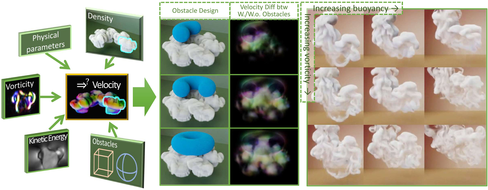

# Learning Meaningful Controls for Fluids
This is the source code for the paper, "Learning Meaningful Controls for Fluids".(to be appear on SIGGRAPH 2021), from M. Chu, N. Thuerey, H.-P. Seidel, C. Theobalt, and R. Zayer.  
The [project page](https://people.mpi-inf.mpg.de/~mchu/projects/den2vel/) contains paper and other materials.  


## Software and Installation

The code is based on Python 3.7, Tensorflow 1.15 and [Mantaflow](http://www.mantaflow.com/) (included). For visualization, ffmpeg is required and blender is only necessary for 3D renderings. PyTorch is only necessary for evaluation purpose using [LSiM](https://github.com/tum-pbs/LSIM). 

### 1. install Python 3.7, ffmpeg, and Tensorflow 1.15 (cpu or gpu with CUDA 10.0).   
As a starting point, a new conda environment ([miniconda](https://docs.conda.io/en/latest/miniconda.html)) is recommended.  
```
# clone the repo and open the base directory
git clone https://github.com/RachelCmy/den2vel.git  
cd den2vel 

# build environment with python 3.7
conda create -n den2vel_ENV python=3.7
conda activate den2vel_ENV # all following operations are using this environment.

# ONLY if ffmpeg is not installed (test by ffmpeg -version)
conda install -c conda-forge ffmpeg

# ONLY if LSiM evaluations are desired, install iPython, PyTorch 1.2.0, and LSiM
conda install -c anaconda ipython
conda install pytorch==1.2.0 torchvision==0.4.0 cudatoolkit=10.0 -c pytorch
git clone https://github.com/tum-pbs/LSIM # LSIM directory will be created under den2vel

# install Tensorflow, we show the GPU case
pip install --ignore-installed --upgrade tensorflow-gpu==1.15rc2

# install required packages
pip install -r ./requirements.txt

# ONLY if LSIM is installed and skimage>=0.17, an import error need to be fixed by
cd LSIM; git apply ../lib/tinyLSIM.patch; cd ..
```

The code contains simple visualization for density, velocity, and vorticity in 3D. For density rendering (or velocity visualization from a camera view), [openvdb](https://academysoftwarefoundation.github.io/openvdb/index.html)  should be [installed](https://academysoftwarefoundation.github.io/openvdb/build.html#buildBuildStandalone) to generate vdb files that can be used in [blender](https://www.blender.org/).

### 2. compile Mantaflow 
In directory of "mantaflow", there is a slightly modified version of the original one. Mantaflow has parallelized **C++** solver core, **python** scene definition interface. 
If multiple python is installed, please make sure to build Mantaflow with the one we just installed.
```
mkdir mantaflow/build
cd mantaflow/build
# GUI is optional (http://mantaflow.com/install.html)
cmake .. -DGUI=OFF -DOPENMP=ON -DNUMPY=ON
make -j4
cd ../..
# check the installation: make sure that "python tftest.py" and "mantaflow/build/manta tftest.py" are the same
python tftest.py; mantaflow/build/manta tftest.py 
```

The last step of installation is to set the paths in ./lib/_settings.py manually.
Our code could run on Windows systems as well. Please checkout the installations for Tensorflow, Mantaflow, and ffmpeg respectively.

## Play around with the trained model
Here are some example simulations generated by our trained models in 2D and 3D.

### 1. 2D models
```
python runcmd.py 2 0 # drawings, question mark
python runcmd.py 2 1 # regular and irregular obstacles
python runcmd.py 2 2 # a test case with modified vorticity using textures
```

### 2. Evaluations
If LSiM is installed, Models can be evaluated using the following command, taking our 2D model as an example:
```
# it takes a long time since multiple references are generated using traditional solver.
python runcmd.py 4 
```
In the simple example, 4_initial_density_field &times; 150_frame are tested, while the evaluation table in the paper is summarized over 20_initial_density_field &times; 200_frame are tested cases.

### 3. 3D models
Note that 3D simulations take longer for if Ground-Truth simulation step is required by "--withRef".

```
python runcmd.py 3 0 # plume
python runcmd.py 3 1 # obs plume
```
If openvdb-python is installed and "--VDB_Flag" is given, OpenVDB files will be saved and can be used for rendering in blender. Please make sure that the "--summary_dir" is empty, otherwise there will be over-writing problems.


## Data Generation and Training

### 1. Data Generation
Use the following commands to generate simulation datasets for training and validation:
```
# 2D simulations without obstacles, c.a. 30G
python runcmd.py 0 0 
# 2D simulations with obstacles, c.a. 12G
python runcmd.py 0 1
# add moving velocities to the previous 2D obstacle dataset, c.a. 12G
python runcmd.py 0 2

# 3D cases:
python runcmd.py 1 0 # without obstacles, c.a. 1.5T
python runcmd.py 1 1 # with obstacles, c.a. 0.5T
python runcmd.py 1 2 # add moving velocities, c.a. 0.5T

```
A directory of "datasets" will be created under the data_path (in ./lib/_settings.py file).  
Under the "data_path/datasets", there will be four sub-folders, "2D_no_obs", "2D_obs", "3D_no_obs", and "3D_obs". Visualizations are automatically saved as mp4 files. They can be deleted, but they are small compared to the npz volumetric data.

### 2. Training 
Training a normal 2D model takes 2 stages. On NVIDIA Quadro RTX 8000, the first stage takes 2 hours and the second one takes 8 hours.
It takes another 8 hours to train a 2D model considering moving obstacles based on the previous training.
The following command trains the 3 stages one by one in 2D:
```

python runcmd.py 5 # 2D training 
# trained models are saved in "data_path/tests/ex_TR00-00-00-00-00/II/models" 
# and "data_path/tests/ex_TR00-00-00-00-00/OBS/models" 
```

Training 3D models without and with obstacles is similar, while it takes 8 days and uses all 48G GPU memory.
```
python runcmd.py 6 # 3D training
# trained models are saved in "data_path/tests/ex_TR00-00-00-00-00/II/models" 
# and "data_path/tests/ex_TR00-00-00-00-00/OBS/models" 
```
"data_path/tests/ex_TR00-00-00-00-00/II/train/" folder contains mp4 files to show how model improves.  
The training log (if not disabled by --noTFBOARD_LOG) can be visualized using Tensorboard:  
`python runcmd.py 8000 # please manually set paths for runcase 8000 in runcmd.py`


# BibTex citation

```
@article{,
	author = {Chu, Mengyu and Thuerey, Nils and Seidel, Hans-Peter and Theobalt, Christian and Zayer, Rhaleb},
	title = {Learning Meaningful Controls for Fluids},
	year = {2021},
	issue_date = {August 2021},
	publisher = {Association for Computing Machinery},
	address = {New York, NY, USA},
	volume = {40},
	articleno = {100},
	number = {4},
	journal = {ACM Trans. Graph.},
	month = {7},
	pages={100:1-100:13},
	year={2021},
	publisher={ACM}
}
```
